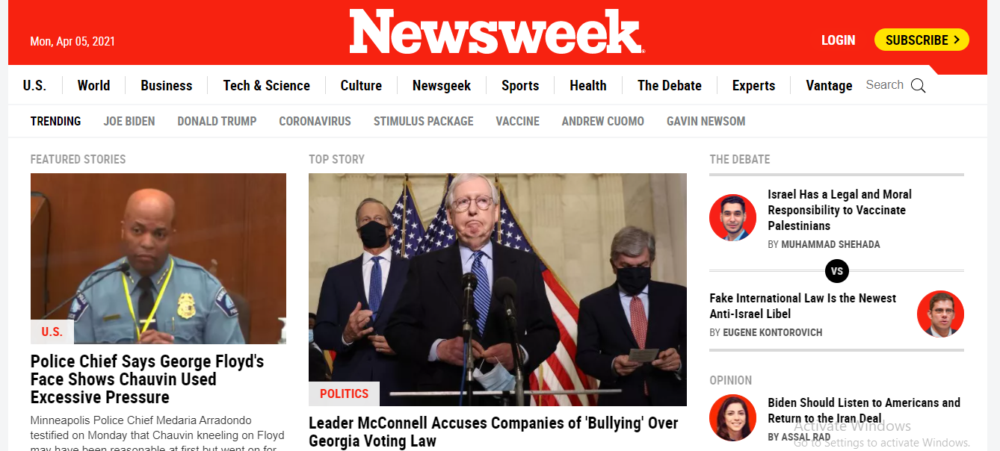

# News Week Project Clone
This is a week 3 project to be implemented with bootstrap

In this project we have cloned [this](https://web.archive.org/web/20210120125445/https://www.newsweek.com/) Newsweek web page using Bootstrap. We have implemented HTML5 and a little bit CSS as most of the styles come from Bootstrap. Also, instead of using Media Queries for responsiveness, we have used predefined classes from Bootstrap. 

## Built With

- HTML5  
- CSS
- Flexbox and Grid layouts with predefined classes in Bootstrap
- Responsiveness by using predefined classes in Bootstrap

## Live Demo

[Live Demo Link](https://alexandermorales-dev.github.io/bootstrap-project/)

## Getting Started

**To get a local copy up and running follow these simple steps.**

### Prerequisites

-Web browser

#### Setup

On GitHub bash
    _git clone https://github.com/AlexJustAlex2020/bootstrap-project.git_

#### Usage

- Most Operative Systems have the .html file extension associated to open with your default web browser.
> In order to review the code, you may use your web browser inspect element option or open directly with a text editor.
- In the cloned folder access open
    _index.html_

### Install

-No installation required

### Deployment

-You can deploy this project by cloning it, then:

- Go to the repository's settings.
- Navigate to GitHub Pages section.
- Select the appropriate branch.
- Submit your changes.

## Authors

👤 **Author1**

- GitHub: [@DanSam5K](https://github.com/DanSam5K)
- Twitter: [@_dan_sam](https://twitter.com/_dan_sam)
- LinkedIn: [DanielSamuel](https://www.linkedin.com/in/dansamuel//)

👤 **Author2**

- GitHub: [@Alex ](https://github.com/alexandermorales-dev/)
- Twitter: [@Alexand81099721 ](https://twitter.com/Alexand81099721)
- LinkedIn: [AlexanderMorales](https://www.linkedin.com/in/alexander-morales-b8539898/)

## 🤝 Contributing

Contributions, issues, and feature requests are welcome!

Feel free to check the [issues page](../../issues/).

## Show your support

Give a ⭐️ if you like this project!

## Acknowledgments

- [Microverse](https://www.microverse.org/)
- [Newsweek](https://newsweek.com/)

## 📝 License

This project is [MIT](./MIT.md) licensed.
